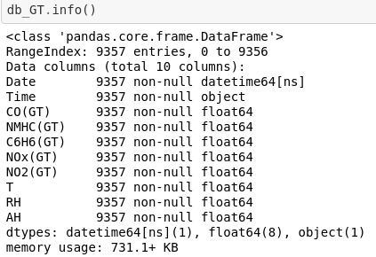
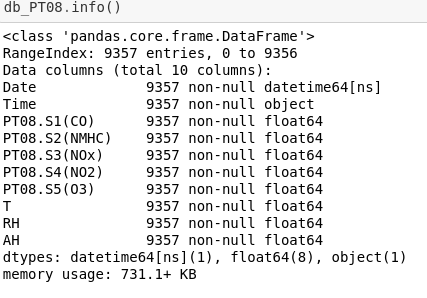
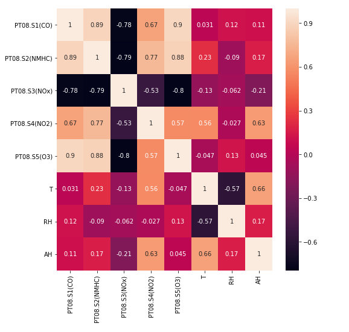
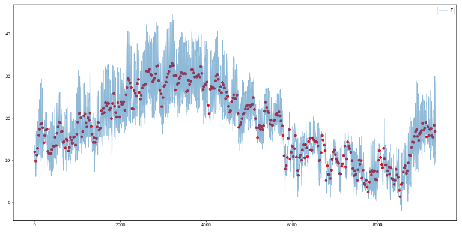
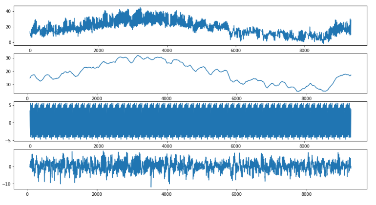

<h1>Air-Quality</h1>

<h3>Objetivo do Repositório</h3>

Análise exploratória de dados retirados do site da UCI, para fins de avaliação do curso de verão do mestrado na EMAP.
    Endereço da base de dados : 

<a href="http://archive.ics.uci.edu/ml/datasets/air+quality">http://archive.ics.uci.edu/ml/datasets/air+quality</a>

<h3>Informações no site do UCI</h3>

<b>Data Set Information:</b>

The dataset contains 9358 instances of hourly averaged responses from an array of 5 metal oxide chemical sensors embedded in an Air Quality Chemical Multisensor Device. The device was located on the field in a significantly polluted area, at road level,within an Italian city. Data were recorded from March 2004 to February 2005 (one year)representing the longest freely available recordings of on field deployed air quality chemical sensor devices responses. Ground Truth hourly averaged concentrations for CO, Non Metanic Hydrocarbons, Benzene, Total Nitrogen Oxides (NOx) and Nitrogen Dioxide (NO2) and were provided by a co-located reference certified analyzer. Evidences of cross-sensitivities as well as both concept and sensor drifts are present as described in De Vito et al., Sens. And Act. B, Vol. 129,2,2008 eventually affecting sensors concentration estimation capabilities. Missing values are tagged with -200 value. This dataset can be used exclusively for research purposes. Commercial purposes are fully excluded.

<b>Source :</b>

Saverio De Vito (saverio.devito '@' enea.it), ENEA - National Agency for New Technologies, Energy and Sustainable Economic Development

Informação sobre as variáveis

<ul>
    <li>0) Date (DD/MM/YYYY)</li>
    <li>1) Time (HH.MM.SS)</li>
    <li>2) True hourly averaged concentration CO in mg/m^3 (reference analyzer)</li>
    <li>3) PT08.S1 (tin oxide) hourly averaged sensor response (nominally CO targeted)</li>
    <li>4) True hourly averaged overall Non Metanic HydroCarbons concentration in microg/m^3 (reference analyzer)</li>
    <li>5) True hourly averaged Benzene concentration in microg/m^3 (reference analyzer)</li>
    <li>6) PT08.S2 (titania) hourly averaged sensor response (nominally NMHC targeted)</li>
    <li>7) True hourly averaged NOx concentration in ppb (reference analyzer)</li>
    <li>8) PT08.S3 (tungsten oxide) hourly averaged sensor response (nominally NOx targeted)</li>
    <li>9) True hourly averaged NO2 concentration in microg/m^3 (reference analyzer)</li>
    <li>10) PT08.S4 (tungsten oxide) hourly averaged sensor response (nominally NO2 targeted)</li>
    <li>11) PT08.S5 (indium oxide) hourly averaged sensor response (nominally O3 targeted)</li>
    <li>12) Temperature in °C</li>
    <li>13) Relative Humidity (%)</li>
    <li>14) AH Absolute Humidity</li>
</ul>

<h3>Resultados</h3>

As informações dos dados estão nas figuras abaixo. (GT) Refere-se à concentração média 
    verdadeira horária do componente pelo analisador de referência, enquanto que (PT08) 
    refere-se à resposta média do sensor por hora.

A correlação das variáveis segue abaixo.

Conforme observamos os valores da matriz de covariância, verificamos que os gráficos 
    iniciais estão de acordo com os valores contidos na matriz elemento a elemento. 
    Logo, entendemos que as principais variáveis que explicam a Temperatura são aquelas 
    que estão mais correlacionadas com ela, ou seja, AH, RH, NO2, NMHC. 
    Vamos então verificar a distribuição de cada uma delas de maneira mais próxima.

Foram então comparadas algumas séries diárias com as respectivas séries por hora de certas
    variáveis. O resultado de um dos gráficos pode ser visto abaixo.

Foi possível então perceber que as curvas com a mudança de frequência 
    ficam mais suavizadas por conta das médias diárias. 
    Na medida em que utilizamos as médias diárias em vez dos 
    valores por hora, podemos estar perdendo informação ( de 9357 observações para 
    391), portanto ficou decidido que para as análises posteriores 
    utilizar-se-iam dados com frequência por hora.
 

Prosseguindo para a análise da Temperatura como série temporal 
    (observação de tendência, estacionariedade e resíduos), obteve-se o resultado abaixo.

<b>CONCLUSÃO :</b> Observando os pesos das combinações da primeira componente 
    (que representa 80% das explicações do modelo) sabemos que a 
    variável que apresenta maior peso dentro da componente é 
    aquela relacionada ao NO2, o que é interessante, pois a 
    intuição nos leva a acreditar que o mesmo seria direcionado 
    ao CO.

